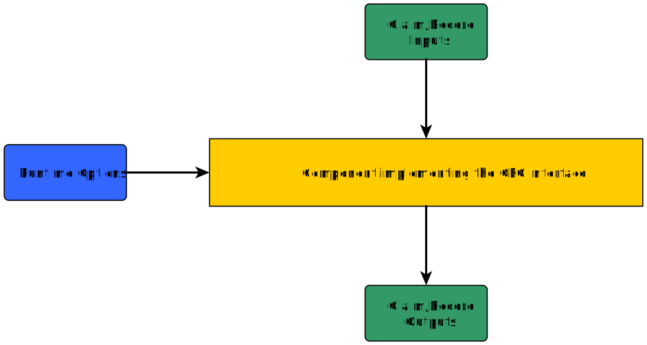
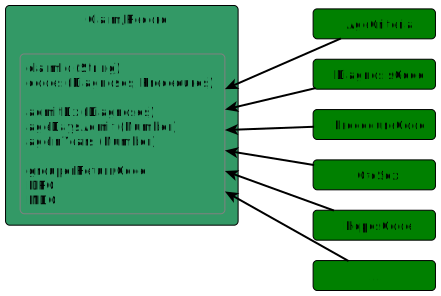

# GFC Base API

  

## Overview

This *base API* consists of:

- The GFC `Claim` class and `IClaim` interface
    - A claim implementation contains all input parameters and output values of a component
    - This is the *public interface* of your component
- The `Processable` interface
    - An instance of a `Processable` is used to run the component
- The `ComponentRuntime` class
    - A map containing key-value pairs for configuring a component/`Processable`
- Various model classes and interfaces like `ProcedureCode`, `DiagnosisCode`, `Code`, `Flags`, etc.
    - These are optional and can be used in a claim implementation
- The `ComponentName` interface
    - An enumeration implemenation with one single entry: The name of the component
- The `ComponentVersion` interface
    - An enumeration implementation with all component versions which exist in the build
- The `ComponentPackage` interface
    - An "extension" for `ComponentName` and/or `ComponentVersion` to customize the base package
      path
- The `ComponentType` enumeration (deprecated)
    - A listing of all C&ER components
    - *This enumeration is only here for compatibility reasons* It will be removed form the *base
      API* in future releases. `ComponentName` can be used as replacement.

The *base API* can be included in a Maven project with:

```xml
	<dependency>
		<groupId>com.mmm.his.cer.gfc.gfc-api</groupId>
		<artifactId>gfc-base-api</artifactId>
		<version>...</version>
		<!-- Let the implementation choose what version to use. -->
		<scope>provided</scope>
	</dependency>
```

----------------

## Implementation

### Requirements

These are some implementation requirements:

- The `Processable` has to be located on a specific class path (package) consisting of
  the `ComponentName`, the `ComponentVersion` and the properly named class name
    - *com.mmm.his.cer.[ComponentName].[ComponentVersion].[ComponentName]Component* (
      e.g. `com.mmm.his.cer.guni.legacy.GuniComponent`)
        - Component class name: `ComponentName#getName()` string (with the first character
          uppercase) followed by "Component" (for example resulting in `GuniComponent`)
        - The default base package name `com.mmm.his.cer` can be customized with
          the `ComponentPackage` interface
- The `Claim` implementation should also follow the naming scheme *[ComponentName]Claim* (but the "
  Claim" postfix can be chosen for your purpose, for example if "Record" fits your implementation
  better as "*[ComponentName]Record*")
- It is good practice to prefix all the implemented classes with *[ComponentName]* to ensure that
  other components can be run alongside in the same JVM

### Claim

  


The input/output container of a GFC component is called "Claim". This is just a naming chosen for
the GFC framework, your implementation can name it whatever describes your use case best.

* The **bare minimum** setup should implement `IClaim`. This interface only requires you to have a
  claim ID, everything else is up to you.

* The abstract class `Claim` combines `IClaim` and `ICodeList` for the **most common use case**.
  Most components have a list of diagnosis or procedure codes as input.

* If you are implementing a **longitudinal claim** and your data is processed consisting of multiple
  claims, consider using `LongitudinalClaim` (which implements `IClaimList`).

* The claim class should be named `*Claim`, with the name prefix of `ComponentName` (
  e.g. `GuniClaim`)

An example `Claim` implementation:

```java
public class GuniClaim extends Claim {

  // inputs
  private String admitDx;
  private int grouperFamily;
  private int icdVersion;
  private int ageInYears;
  private int dischargeStatus;
  private int ageDaysAdmit;
  private int ageDaysDischarge;
  private int birthWeightOption;
  private int birthWeight;
  private GfcSex sex;

  // outputs
  private int fiGrc;
  private int fiMdc;
  private int fiDrg;

  // ...

}

```

**Note:** It is strongly encouraged to group inputs and outputs in two separate classes and use them
in the claim implementation instead.

```java
public class GuniInputs {

  private String admitDx;
  private int grouperFamily;
  private int icdVersion;
  private int ageInYears;
  private int dischargeStatus;
  private int ageDaysAdmit;
  private int ageDaysDischarge;
  private int birthWeightOption;
  private int birthWeight;
  private GfcSex sex;

  //...
}
```

```java
public class GuniOutputs {

  private int fiGrc;
  private int fiMdc;
  private int fiDrg;

  //...
}
```

```java
public class GuniClaim extends Claim {

  private GuniInputs inputs;
  private GuniOutputs outputs;

  //...

}
```

This GFC framework comes with the following data types which can be used in a `IClaim`/`Claim`
implementation:

- AgeCriteria
- Code
- DatePeriod
- DiagnosisCode
- Flags
- FlagsEmpty
- GfcEnum
- GfcPoa
- GfcSex
- HcpcsCode
- ICode
- IDatePeriod
- IDescribable
- IFlags
- IHasGender
- IHasFlags
- ProcedureCode
- GfcDate

And the utilities:

- SimpleGfcDateFormat

Based on the above `GuniClaim` implementation, the following would be implemented as well:

```java
public class GuniDiagnosisCode extends DiagnosisCode {

  protected String usageFlags;

  // ...

}
```

```java
public class GuniProcedureCode extends ProcedureCode {

  protected int daysAfterAdmissionPerformed;
  protected String usageFlags;

  // ...

}
```

### Component Runtime Options

Runtime options are used to configure a component/`Processable`. These options are intended to
configure the component once and then run one or more claims through it. Some components may not
have or need any runtime options but are still required to provide one to satisfy the `Processable`
signature

The `ComponentRuntime` class introduces a component-specific type safety for processing options;
e.g. setting an analysis period for data processing, enabling or disabling code mapping, or settings
the grouper version for a legacy Domain component. `ComponentRuntime` is a `java.util.Map` where the
Key (`K`) is some enumeration and Value (`V`) is a String. This class replaces the previous, empty
interface, `RuntimeOption` found in earlier (<*v2.2.0*) GFC releases.

It's important to note that `ComponentRuntime` is intentionally abstract forcing component engineers
to provide their own implementation along with enumerable options.

The `ComponentRuntime` class has to be extended to implement the runtime options for a component. In
addition, an enumeration is needed for the runtime options keys.

```java
public enum MyRuntimeOptionsKey {
  KEY_1,
  KEY_2
}
```

```java
public class MyComponentRuntimeOptions extends ComponentRuntime<MyRuntimeOptionsKey> {

	// Can be empty. The class and key signature is the important part.
	
}
```

See the [usage example](#Usage_Example) below

### Processable

A `Processable` is the actual component which runs the grouping/editing/etc. There are only two
methods which have to be implemented: `process`, `reconfigure` and `close`.

The `process` method needs a [Claim](#Claim) implementation as parameter. Within the `process`
method, input values are retrieved from the claim and output data is added/set on the claim.

The `reconfigure` method is used to pass in [component runtime options](#Component_Runtime_Options).

```java
public class MyGrouperImplementation implements
    Processable<GuniClaim, MyRuntimeOptionsKey, MyComponentRuntimeOptions> {

  private final MyComponentRuntimeOptions option;

  public MyGrouperImplementation(MyComponentRuntimeOptions option) {
    this.option = option;
  }

  @Override
  public void process(GuniClaim claim) throws FoundationException {

    // Retrieve input values from 'claim'

    // Do the grouping/editing/...

    // Set output values on the 'claim'

  }

  @Override
  public void close() {

    // Close the component

  }

  @Override
  public void reconfigure(MyComponentRuntimeOptions option) throws FoundationException {

    // Reconfigure the component (this processable)

  }

}

```

---------------------

## Usage Example

Based on the implementation instructions and examples above, here is a usage example which shows the
use of the generic types and how to instantiate a new component:

```java

GuniClaim claim=new GuniClaim();
    claim.setGrouperFamily(1);
    claim.setAdmitDx("");
    claim.setAgeDaysAdmit(-1);

    // ...

    GuniDiagnosisCode dxCode=new GuniDiagnosisCode("N179",GfcPoa.Y);
    claim.addCode(dxCode);

    GuniProcedureCode prCode=new GuniProcedureCode("3E0234Z",-1);
    claim.addCode(prCode);

    MyComponentRuntimeOptions runtime=new MyComponentRuntimeOptions();
    runtime.put(MyRuntimeOptionsKey.KEY_1,"someValue");

    MyGrouperImplementation processable=new MyGrouperImplementation(runtime);
    processable.process(claim);

    int outputFiDrg=claim.getFiDrg();
    int outputFiMdc=claim.getFiMdc();
    List<GuniDiagnosisCode> dxCodes=claim.getCodes(GuniDiagnosisCode.class);

// ...

```

-------------------------

## Implementation Tips

#### Component Name/Package/Version interfaces

You can combine the three Component interfaces (ComponentName, ComponentPackage, ComponentVersion)
into a single implementation if you wish. This can cut down on classes necessary for your component.
Using an implementation like the one below, now any class/method that requires one of the three
interfaces can use this single implementation.

```java
public enum ProcessorComponentData implements ComponentName, ComponentPackage, ComponentVersion {
  PROCESSOR_100("Processor", "v100", 100),
  PROCESSOR_200("Processor", "v200", 200);

  private final String componentName;
  private final String packageValue;
  private final int versionNumber;

  ProcessorComponentData(String componentName, String packageValue, int versionNumber) {
    this.componentName = componentName;
    this.packageValue = packageValue;
    this.versionNumber = versionNumber;
  }

  @Override
  public String getName() {
    return this.componentName;
  }

  @Override
  public String getBasePackagePath() {
    return "com.aCompany";
  }

  @Override
  public String getPackageValue() {
    return this.packageValue;
  }

  public int getVersionNumber() {
    return versionNumber;
  }

  /**
   * Get {@link ProcessorControlData} from an integer version.
   *
   * @param versionNumber the version number.
   * @return an instance of {@link ProcessorControlData}
   * @throws IllegalArgumentException if there is no factory data for the version.
   */
  public static ProcessorControlData fromVersion(int versionNumber) {
    for (ProcessorControlData value : values()) {
      if (value.versionNumber == versionNumber) {
        return value;
      }
    }
    throw new IllegalArgumentException(
        "No enum found for version [" + versionNumber + "]. Valid versions are: " + Arrays
            .stream(values()).map(item -> String.valueOf(item.versionNumber))
            .collect(Collectors.joining(",")));
  }
}
```

#### Use of the abstract Claim object

The Claim class is not immutable and does allow mutation of state, therefore it can be hard to
control the internal state. Mutations of object added to the claim will impact the internal state,
even if those mutations happen outside the Claim. You should only extend and use the abstract Claim
class if you know the internal data storage of abstract claim will work for your GFC Component and
that exposed internal state is acceptable in you application.

In most cases it is better to use the `IClaim`interface (which is required) and create your own
Claim implementation so that internal state and storage mechanisms can be customized precisely.


  
  
  